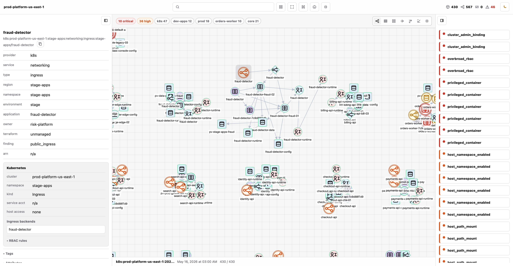
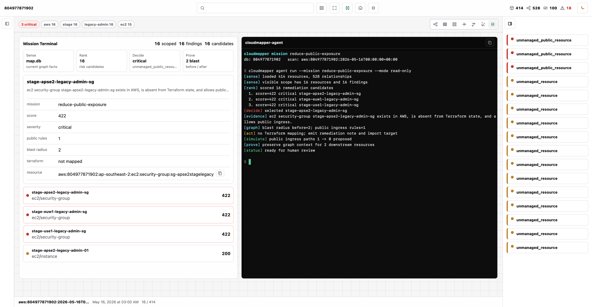
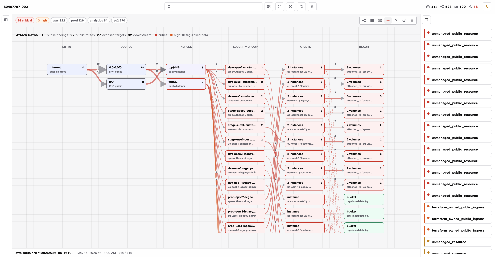
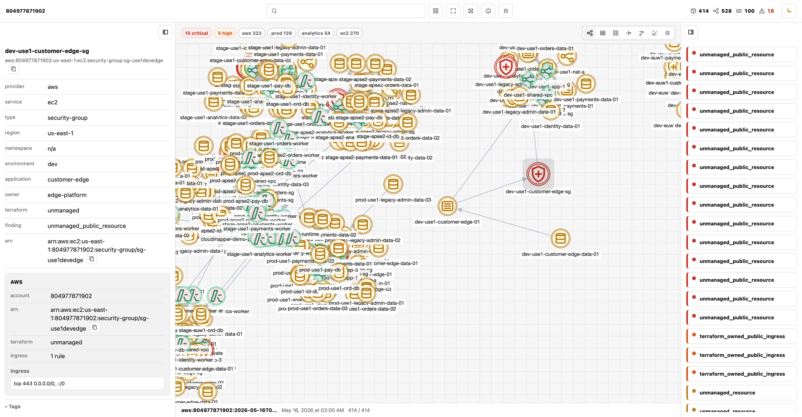
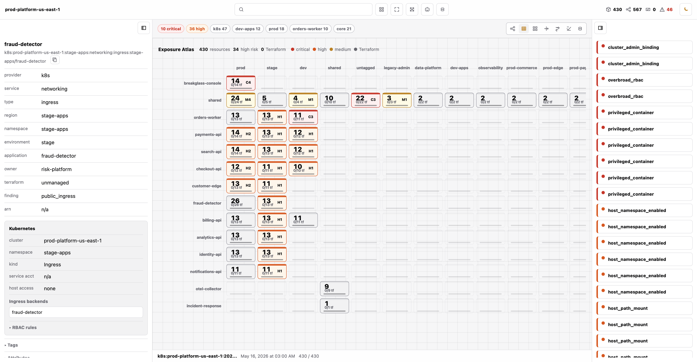

# cloudmapper

`cloudmapper` is a standalone Rust CLI that maps AWS and Kubernetes reality
into an agent-readable `infra/` bundle and queryable `map.db` knowledge store.
It feeds agents structured resources, relationships, Terraform state mappings,
drift and security findings, and a local graph UI backed by SQLite.

[GitHub repository](https://github.com/ingresslabs/cloudmapper) ·
[Latest release](https://github.com/ingresslabs/cloudmapper/releases/latest)

## Install

Linux:

```bash
curl -L https://github.com/ingresslabs/cloudmapper/releases/latest/download/cloudmapper-linux.tar.gz | tar -xz
sudo install -m 0755 cloudmapper /usr/local/bin/cloudmapper
```

macOS:

```bash
curl -L https://github.com/ingresslabs/cloudmapper/releases/latest/download/cloudmapper-macos.tar.gz | tar -xz
sudo install -m 0755 cloudmapper /usr/local/bin/cloudmapper
```

## Screenshots







AI-generated documentation is intentionally out of scope for this phase; it can
be layered on top of the structured store later.

## Development

```bash
make build
make test
make check
```

Useful local targets:

- `make build` builds the CLI.
- `make test` runs unit tests.
- `make check` runs formatting, type checking, lints, tests, and a debug build.
- `make clippy` runs Rust lints.
- `make demo` writes a zero-AWS large-org demo bundle to `infra/`.
- `make demo-k8s` writes a zero-cluster Kubernetes platform demo bundle to
  `infra-k8s/`.
- `make ui DB=infra/map.db` serves the local Cytoscape UI.
- `make demo-ui` writes the demo bundle and serves it from `infra/map.db`.
- `make demo-k8s-ui` writes the Kubernetes demo bundle and serves it from
  `infra-k8s/map.db`.
- `make loc` counts lines in source files.
- `make clean` removes Cargo build output.

## First Five Minutes

Try the full local workflow without AWS credentials:

```bash
make demo
make demo-ui
```

Open `http://127.0.0.1:8765`. The demo bundle models a realistic large
organization account with three regions, prod/stage/dev environments, six
application teams, EC2 fleets, VPC networking, RDS databases, Lambda workers,
S3 data buckets, IAM principals, a partial Terraform state, compare findings,
`graph.json`, and a populated `infra/map.db`.

Try the Kubernetes workflow without a live cluster:

```bash
make demo-k8s
make demo-k8s-ui
```

Open `http://127.0.0.1:8765`. The Kubernetes demo models a large platform
cluster with 430 resources, 567 relationships, prod/stage/dev/shared
namespaces, platform nodes and storage classes, workloads across multiple
teams, RBAC grants, public ingress paths, mounted Secrets/ConfigMaps/PVCs, and
69 persisted security findings.

The same workflow against an AWS account is:

```bash
cargo run -- scan aws --profile default --regions all --out infra
cloudmapper terraform import --state terraform.tfstate --db infra/map.db
cloudmapper compare --db infra/map.db --out findings.json
cloudmapper ui --db infra/map.db --bind 127.0.0.1:8765
cloudmapper export agent --db infra/map.db --out infra.agent.json
```

## Usage

Scan AWS:

```bash
cargo run -- scan aws --profile default --regions all --out infra
```

Scan Kubernetes through kubectl:

```bash
cargo run -- scan k8s --context kind-prod --namespace all --out infra
cloudmapper ui --db infra/map.db --bind 127.0.0.1:8765
```

Generate the advanced Kubernetes demo directly:

```bash
cargo run -- demo --provider k8s --out infra-k8s
cloudmapper ui --db infra-k8s/map.db --bind 127.0.0.1:8765
```

Useful AWS options:

- `--profile <name>` uses a named AWS profile. If omitted, the normal AWS
  credential chain is used.
- `--regions all` scans every enabled EC2 region returned by
  `DescribeRegions`.
- `--regions us-east-1,eu-west-1` scans an explicit comma-separated region set.
- `--home-region us-east-1` controls STS, region discovery, and global-service
  client bootstrap.
- `--out infra` writes the generated bundle to the `infra/` directory.
- `--include-raw` mirrors normalized detail blocks into `raw` fields where the
  scanner supports it.
- `--allow-non-empty-out` allows writing into a non-empty directory that does
  not already contain a cloudmapper manifest.

Useful Kubernetes options:

- `--context <name>` selects a kubeconfig context. If omitted, cloudmapper uses
  `kubectl config current-context`.
- `--kubeconfig <path>` passes an explicit kubeconfig path to kubectl.
- `--namespace all` scans every namespace; pass a namespace name to limit
  namespaced resources.
- `--kubectl <path>` selects a kubectl executable.
- `--include-raw` includes raw non-Secret and non-ConfigMap Kubernetes objects.
  Secret and ConfigMap values remain redacted.

## Bundle Layout

```text
infra/
  manifest.json
  inventory.json
  map.db
  resources.jsonl
  relationships.jsonl
  errors.jsonl
  graph.json
  schemas/
    resource.schema.json
    relationship.schema.json
```

`inventory.json` is the complete scan document. The JSONL files are optimized
for indexing. `graph.json` contains nodes and edges derived from the same source
facts. `map.db` stores the same scan as queryable local state and can also hold
imported Terraform state snapshots, compare findings, and UI data.

Every resource has a stable `uid`:

```json
{
  "uid": "k8s:kind-prod:prod:apps:deployment:prod/payments",
  "provider": "k8s",
  "account_id": "kind-prod",
  "region": "prod",
  "service": "apps",
  "type": "deployment",
  "id": "prod/payments"
}
```

Relationships are explicit facts with evidence pointers:

```json
{
  "from": "aws:123456789012:us-east-1:ec2:instance:i-abc123",
  "to": "aws:123456789012:us-east-1:ec2:security-group:sg-123",
  "type": "uses_security_group"
}
```

## Current Coverage

The AWS scanner collects:

- STS account identity
- EC2 regions
- EC2 instances, VPCs, subnets, security groups, route tables, internet
  gateways, NAT gateways, and EBS volumes
- S3 buckets, bucket tags, bucket location, and public-access-block settings
- IAM roles, users, groups, and attached role policies
- Lambda functions and VPC/security-group/role relationships
- Broad tagged-resource discovery through the AWS Resource Groups Tagging API

Recoverable failures are written to `errors.jsonl` so an account scan can still
produce a usable inventory when a service, region, or permission fails.

The Kubernetes scanner collects:

- clusters via kubeconfig context, namespaces, and nodes
- deployments, daemonsets, statefulsets, replicasets, and pods
- services, ingresses, and network policies
- service accounts, roles, role bindings, cluster roles, and cluster role
  bindings
- Secrets and ConfigMaps as redacted resources with data keys only
- persistent volume claims, persistent volumes, and storage classes

It derives relationships for ownership, pod service accounts, service
selectors, ingress backends, RBAC grants, PVC/PV bindings, and pod mounts of
Secrets, ConfigMaps, and PVCs. It also persists Kubernetes findings for
privileged containers, hostPath mounts, host namespace access, missing network
policies, public services and ingresses, overbroad RBAC, cluster-admin
bindings, default service account usage, legacy service-account token Secrets,
and resources without common IaC/GitOps ownership metadata.

## Map Database

Every scan writes `map.db` alongside the JSON files. It is a SQLite database,
but the filename is treated as cloudmapper's map format. The first schema
stores:

- `scans`
- `resources`
- `relationships`
- `scan_errors`
- `terraform_states`
- `terraform_resource_instances`

This is the local knowledge store that compare, drift, graph, export, and MCP
commands can query without reloading the full JSON bundle.

## Terraform State

Import a Terraform state file into the map database:

```bash
cloudmapper terraform import \
  --state terraform.tfstate \
  --db infra/map.db
```

Export the imported Terraform state as normalized JSON:

```bash
cloudmapper terraform export \
  --db infra/map.db \
  --out terraform-resources.json
```

The importer stores each Terraform resource instance with its address, module,
mode, type, provider, index key, attributes, dependencies, and inferred AWS UID
when an ARN is present. It does not write a Terraform-native `tfstate` file;
the export format is a cloudmapper-normalized state view for compare and agent
workflows.

Terraform state can contain secrets. Treat `map.db`, Terraform export files,
and agent exports as local sensitive artifacts unless they have been explicitly
reviewed and redacted.

## Compare

After an AWS scan and Terraform import, compare AWS reality with Terraform
state:

```bash
cloudmapper compare \
  --db infra/map.db \
  --out findings.json
```

The first compare engine emits structured findings for:

- AWS resources absent from imported Terraform state
- unmanaged public security groups, including reverse relationship blast radius
- Terraform-managed public security groups
- Terraform state resources absent from the AWS scan

Findings are written to the JSON report and persisted in the map database
`findings` table for later query, context, and MCP workflows.

## Agent Export

Export one portable JSON file for agent workflows:

```bash
cloudmapper export agent \
  --db infra/map.db \
  --out infra.agent.json
```

The agent export includes the latest scan, resources, relationships, Terraform
resource mapping, compare findings, evidence, blast radius, recommended actions,
and graph nodes/edges in one file. It redacts raw scan details, resource
attributes, Terraform state source paths, and Terraform attributes by default.
Pass `--include-sensitive` only when the export will stay in a trusted local
context. Use `--out -` to print the JSON to stdout.

## UI

Serve the local map database as a Cytoscape graph:

```bash
cloudmapper ui --db infra/map.db --bind 127.0.0.1:8765
```

Open `http://127.0.0.1:8765` to inspect the latest AWS or Kubernetes scan,
Terraform state mapping when present, relationships, and findings. Critical
and high findings are overlaid directly on graph nodes, and the side panels
provide service/environment/application filters, Terraform-managed filtering,
finding navigation, blast radius, and recommended actions. The Cytoscape
runtime is bundled into the CLI assets, so the local UI does not need to fetch
JavaScript from a CDN.

## Local Installation

Install the local checkout with Cargo:

```bash
cargo install --path .
```

Generate shell completions to a file:

```bash
cloudmapper completions zsh > _cloudmapper
cloudmapper completions bash > cloudmapper.bash
cloudmapper completions fish > cloudmapper.fish
```

## Errors

CLI failures are printed as a compact block on stderr:

```text
cloudmapper error: AWS credentials are expired
context: calling sts:GetCallerIdentity
hint: refresh AWS credentials and retry; for AWS SSO run `aws sso login`, or pass `--profile <name>` for a valid profile
details:
  - failed to refresh cached Login token: Your session has expired. Please reauthenticate.
  - AccessDeniedException: The refresh token has expired.
```

Noisy AWS SDK warning chains are suppressed by default so the actionable
message stays visible.

## Verification

```bash
make build
make test
make check
```

On small local disks, the AWS SDK crates are much lighter with debug info
disabled. The Makefile uses that setting by default; with Cargo directly:

```bash
CARGO_PROFILE_DEV_DEBUG=0 CARGO_BUILD_JOBS=1 cargo test
```

## CI

GitHub Actions runs on `main` pushes and pull requests:

- `cargo fmt --check`
- `cargo check --locked`
- `cargo clippy --all-targets --locked -- -D warnings`
- `cargo test --locked`
- `cargo build --locked`

Release builds run when a `v*` tag is pushed and publish Linux and macOS CLI
archives plus SHA-256 checksum files to the GitHub release.

## Git Tagging

Use annotated SemVer tags:

```bash
git tag -a v0.1.0 -m "cloudmapper v0.1.0"
git push origin main
git push origin v0.1.0
```

Do not move published tags. If a release tag is wrong, create the next patch tag.
